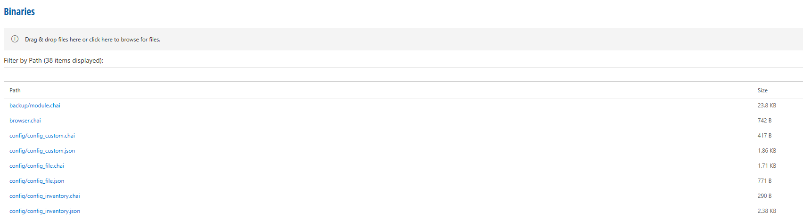
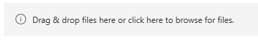
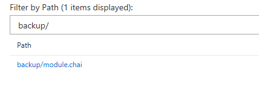
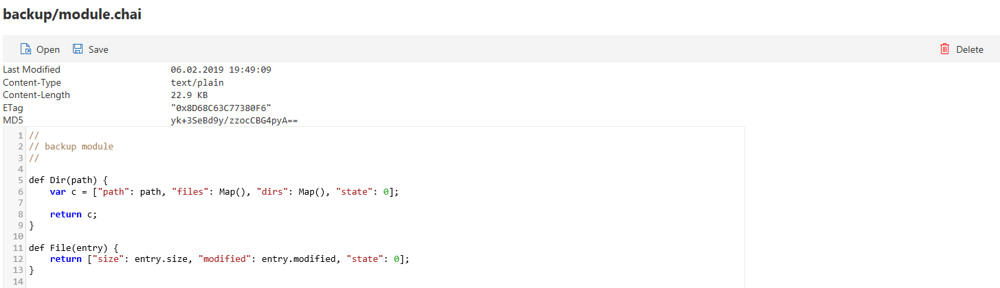

# Binaries

This menu contains a list of binaries which are part of **RealMigrator**, like .json files or .chai scripts.

## Import Binaries

Beside the default existing binaries, it is possible to import own binaries and scripts. There are two different options to import binaries into **RealMigrator**:

### Option 1

1. Click the **Drag & drop field**

2. Choose a file
3. Finally, click **Open**

### Option 2

1. Search a script or binary on the own computer
2. Drag and drop this script or binary into the **Drag & Drop field**

## Filter by Path

**Filter by Path** is a filter function based on the file name. To search for a file, enter the name of the file. The filter shows the results automatically in the list.

## Binary Details

To see further details or to delete a binary, click on a name of a binary.

This example above shows a script for the binary **backup/module.chai**.

A detail overview contains information about last modification, content-type, content-length, an ETag and a MD5.\
Additionally, the script is shown as well. It is possible to edit this script manually with a click into the script field. A click on the **Save** button will save the edits.

With a click on the **Open** button, the script will open in a new tab. It is not possible to edit a script in this tab.

### Delete a script

If a script is no longer necessary or incorrect, it is possible to delete it. Click **Delete** in the upper-right corner to delete a script.
