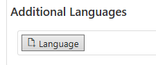

# Server Configuration

Server Configuration is the start screen of RealMigrator:

Server Configuration gives an overview about **Client Version**, **Super Administrators**, **Administrators**, **View-Only Administrators** and **Users**.

By default all data will be migrated to the RealMigrator cloud storage farm. But when a company decides to migrate to its own server or storage the input field **External Storage** is visible (below input field View-Only Users).

**Global Client Configuration** contains default settings for migration. Via own scripts it is possible to individualize the migrations.

## Roles in RealMigrator

The following table gives an overview about the roles and their permissions.

| Role                    | Explanation                                                                                                                                                                                           |
| ----------------------- | ----------------------------------------------------------------------------------------------------------------------------------------------------------------------------------------------------- |
| Super Administrator     | All RealMigrator rights and permissions.                                                                                                                                                              |
| Administrator           | 
Limited permissions. Only permissions to create and edit <strong>Groups</strong> and users and clients. No permissions to edit <strong>Modules</strong> and <strong>Configurations</strong>
 |
| View-Only Administrator | Only permission to browse through RealMigrator.                                                                                                                                                       |
| User                    | A user has only the permission to list and edit client objects which have the same UPN. Use `*` to match all users.                                                                                   |

## Global Client Configuration

Global Client Configuration is necessary for general migration configurations and general migration settings. A super administrator (an administrator as well) has the possibility to configure a **Log Level**, a **Module loop delay** and a **Reset code**.

| Setting           | Explanation                                                                                                                                                                                                                                                                                                                                                                                                                                                                                                            |
| ----------------- | ---------------------------------------------------------------------------------------------------------------------------------------------------------------------------------------------------------------------------------------------------------------------------------------------------------------------------------------------------------------------------------------------------------------------------------------------------------------------------------------------------------------------- |
| Log Level         | Three different log levels are available: **Error**, **Info** and **Debug**                                                                                                                                                                                                                                                                                                                                                                                                                                            |
| Module loop delay | Sleeptime after looping through modules. The default value are 1 800 000 ms (30 minutes).                                                                                                                                                                                                                                                                                                                                                                                                                              |
| Reset code        | A client is always checking the own configurations after a defined period of time. This means that the client compares the selected client settings with the selected server settings. In addition the client connect to the server based on Module loop delay. By this time value the client is starting a Module loop and the client is checking the Reset code. If there is a change the client will takes over the new configuration. If there is no change, the client will still use the existing configuration. |

### Bandwidth Settings

RealMigrator offers seven settings for bandwidth. Each of them have defaults. Of course a super administrator (an administrator as well) has the possibility to set own settings.

| Settings                 | Explanation                                                                                                                                      |
| ------------------------ | ------------------------------------------------------------------------------------------------------------------------------------------------ |
| Maximum bandwidth        | Default bandwidth are 2000 kBit/s                                                                                                                |
| Slow network barrier     | 
Will be detected as 'slow' network if network speed is below this value. Default are 800 kBit/s. <strong>0</strong> means disabled
     |
| Unusable network barrier | 
Will be detected as 'unusable' network if network speed is below this value. Default are 200 kBit/s. <strong>0</strong> means disabled
 |
| Minimum sleep time       | Time to sleep per request. Default are 1000 ms. **0** means disabled                                                                             |
| Slow network usage       | Maximum percent of usage on a slow network. Default are 25 % (0.25)                                                                              |
| Unusable wait time       | Time to sleep in an unusable network. Default are 900 seconds (15 minutes)                                                                       |
| Use metered connection   | If to use network connections which are marked as metered                                                                                        |

### UI Settings

During a migration, RealMigrator shows clients different screens and instructions. With **UI Settings** a super administrator can configure the instructions, explanations texts and dialog screens. Rudimentary interface settings are also manageable.

Beside the defaults (German and English) it is possible to add further languages. Available are Arabic, Chinese, French, Hindi, Japanese, Portuguese and Spanish.

**NOTE**: No translations or phrases are available in these seven languages. English texts are given and an own translation must be implemented

### Script

RealMigrator offers a default script for **Global Client Configuration**. But it is possible to edit the existing script or to writing a new script.

These following functions have to be part of the script:

| Script                  | Functions                                                                                                                                               |
| ----------------------- | ------------------------------------------------------------------------------------------------------------------------------------------------------- |
| `getClientId()`         | Returns a string that uniquely identifies the client                                                                                                    |
| `getGroupId()`          | 
Returns the id string of a group where the client belongs to. This might be some kind of location information or any other grouping criteria.
 |
| `getDisplayName()`      | Returns a display name that is used by the admin web                                                                                                    |
| `getMainConfig(config)` | 
Returns a dictionary with further configuration parameters. - <strong>Input parameter</strong>: server configuration
                          |

## Further Settings

There are even more settings at the top of the page.

### Import Scripts, Client and Save

| Setting        | Explanation                                                                                                                                                                                                                                       |
| -------------- | ------------------------------------------------------------------------------------------------------------------------------------------------------------------------------------------------------------------------------------------------- |
| Import Scripts | 
Import a new configuration. Select the carbon.zip folder to update your configurations. For further details about script import see [Binaries]({{&#x3C; ref "beginning/binaries/_index.md" >}})
                                         |
| Client         | 
<strong>Import Client</strong>: Import a client from a PC or machine to RealMigrator <strong>Delete Client</strong>: Delete an existing client in RealMigrator <strong>Download Client</strong>: Download a client from RealMigrator
 |
| Save           | With a click on **Save** all changes in **Server Configuration** will be saved                                                                                                                                                                    |

### Copy Storage Token and Admin Consent

| Setting            | Explanation                                                                                                                                                                                                                      |
| ------------------ | -------------------------------------------------------------------------------------------------------------------------------------------------------------------------------------------------------------------------------- |
| Copy Storage Token | This token contains the whole migration configuration and the migration data. With a storage token you have access to your storage (via SAS-key)                                                                                 |
| Admin Consent      | Sign-in to your tenant (with a global administrator). Via **Admin Consent** you configure the RealMigrator permissions for the migration. Furthermore Azure Active Directory checks if RealMigrator gets granted access to data. |

## Reset Button

If you click the **Reset** button in the **Config** tab or in the **Script** tab, all your entries will be reset to the RealMigrator default values.

To accept the default values you have to click **Save** at the top of the page.
