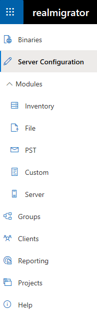

# Sidebar

RealMigrator offers a number of options to configure a migration in different ways. These options give abilities to configure and adjust **Binaries**, **Server Configuration**, **Modules**, **Groups**, **Clients**, **Reporting** and **Projects**.

The following table gives a short overview about these options and their functions:

| **Option**                          | **Explanation**                                                                                                                                                                                                                                                                                                                                                                                                                                                   |
| ----------------------------------- | ----------------------------------------------------------------------------------------------------------------------------------------------------------------------------------------------------------------------------------------------------------------------------------------------------------------------------------------------------------------------------------------------------------------------------------------------------------------- |
| Binaries                            | List of binaries which are part of RealMigrator                                                                                                                                                                                                                                                                                                                                                                                                                   |
| Server Configuration (start screen) | 
Information about client version and an overview about current administrators and users. Also bandwidth settings and UI settings (UI during a migration)
                                                                                                                                                                                                                                                                                                |
| Modules                             | 
Five different modules: <strong>Inventory:</strong> Collects machine data through WMI, registry and other means <strong>File:</strong> Searches for files and copies them to a defined destination <strong>PST:</strong> Searches for Outlook PST files and copies them to defined storage <strong>Custom:</strong> Possibility to create own scripts <strong>Server:</strong> Information about PST import server and Teams notifications.
 |
| Groups                              | Creation of new groups and details about existing groups, like migration progress                                                                                                                                                                                                                                                                                                                                                                                 |
| Clients                             | A list of assigned clients for a migration                                                                                                                                                                                                                                                                                                                                                                                                                        |
| Reporting                           | Reports about (upcoming) processes and system errors                                                                                                                                                                                                                                                                                                                                                                                                              |
| Projects                            | Overview about current migration projects                                                                                                                                                                                                                                                                                                                                                                                                                         |
| Help                                | Links to the RealMigrator documentation and the API documentation                                                                                                                                                                                                                                                                                                                                                                                                 |
