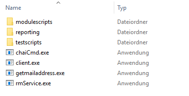
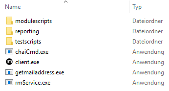

# Client Executables

## Clients

In general, clients are services which send requests to programs, computers or servers. Such requests set up connections between a request sender and a request recipient. Once started, such a connection will run itself. RealMigrator offers three different clients. The following chapter will present them.

Click the link to download RealMigrator client.exe files: https://gkrealmigratorproductive.blob.core.windows.net/releases/carbon.zip

The download will start automatically. A Zip folder (**carbon.zip**) appears:

Extract all files:

