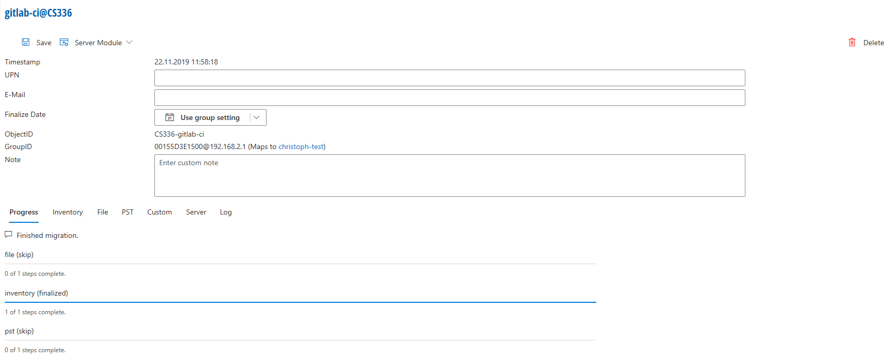
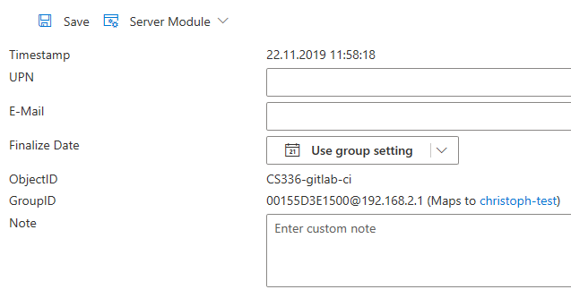

# Client Information

With a click on a client, the following menu appears:

This menu contains information about a single client:

* Date and time of **Last Message**
* UPN and E-Mail address of the client
* ObjectID and GroupID
* Custom Note about the client

Furthermore, this menu contains details about the migration progress of all modules
