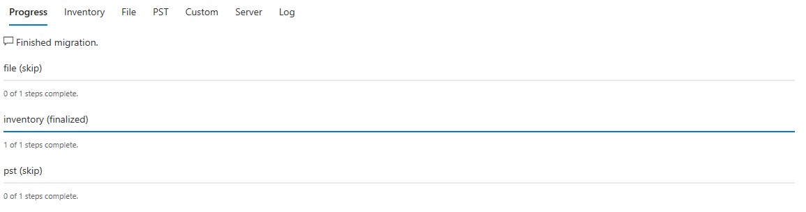
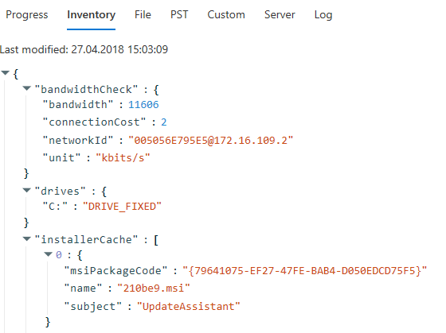
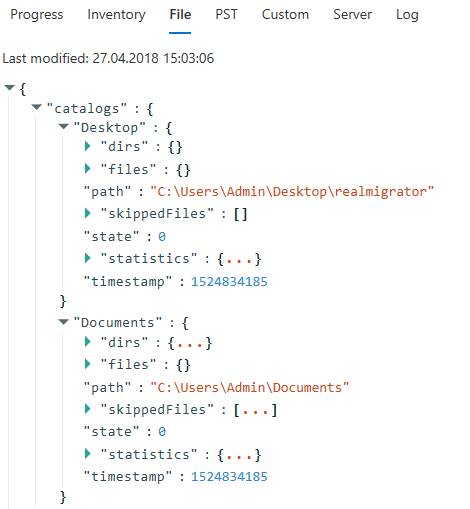
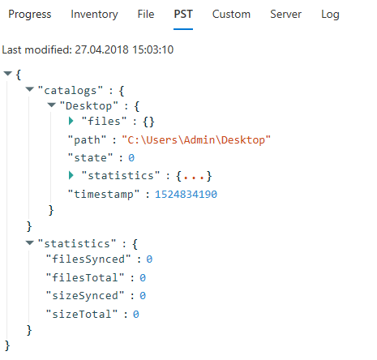
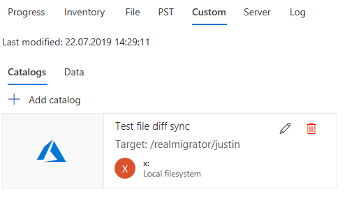
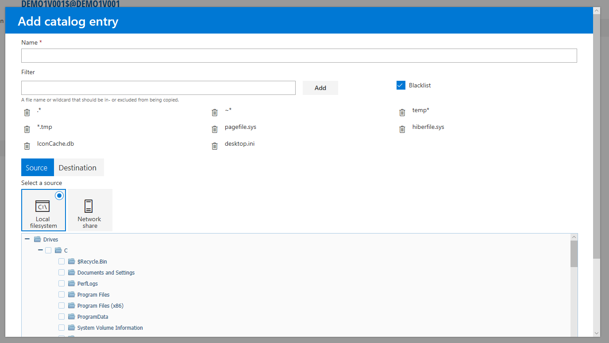
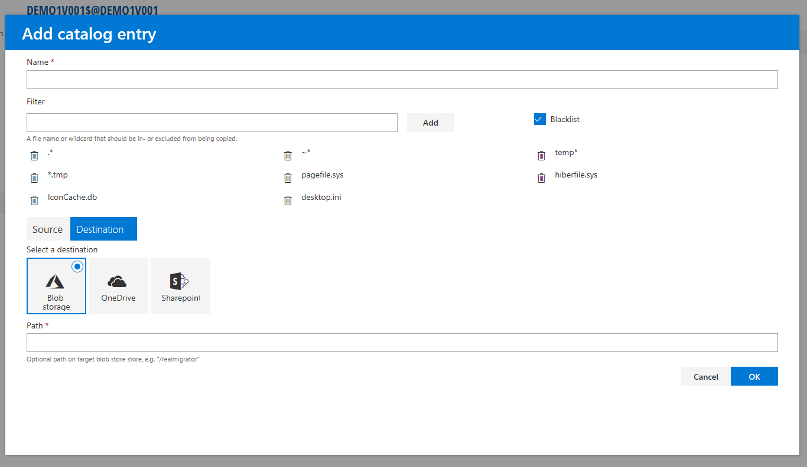

# Module Information

## Progress in general

In this example **File** and **PST** are skipped and **Inventory** is finalized

## Inventory Tab

The Inventory tab shows details about **bandwidth**, **drives** and **installerCache**

## File Tab

The File tab shows a list of migrated files and documents. Click the three red dots to see more details.

### **Synchronization states**

<table><thead><tr><th width="153">Name</th><th width="85">Value</th><th>Description</th></tr></thead><tbody><tr><td>st_check</td><td>0</td><td>Check for files to upload if the item is a directory, ask for a filter if it is a file. After checking, there are no files to upload.</td></tr><tr><td>st_use</td><td>1</td><td>Has files to upload if the item is a directory, upload if it is a file.</td></tr><tr><td>st_exclude</td><td>2</td><td>Do not check if the item is a directory, do not upload if it is a file.</td></tr><tr><td>st_delete</td><td>3</td><td>Delete remote.</td></tr><tr><td>st_sync</td><td>4</td><td>File was synchronized.</td></tr><tr><td>st_agent</td><td>5</td><td>Directory will be processed by upload agent.</td></tr></tbody></table>

## PST Tab

The PST tab shows a list of migrated PST files and PST documents. Click also the three red dots to see more details.

### **Synchronization states**

<table><thead><tr><th width="153">Name</th><th width="85">Value</th><th>Description</th></tr></thead><tbody><tr><td>st_check</td><td>0</td><td>Check for files to upload if the item is a directory, ask for a filter if it is a file. After checking, there are no files to upload.</td></tr><tr><td>st_use</td><td>1</td><td>Has files to upload if the item is a directory, upload if it is a file.</td></tr><tr><td>st_exclude</td><td>2</td><td>Do not check if the item is a directory, do not upload if it is a file.</td></tr><tr><td>st_delete</td><td>3</td><td>Delete remote.</td></tr><tr><td>st_sync</td><td>4</td><td>File was synchronized.</td></tr><tr><td>st_agent</td><td>5</td><td>Directory will be processed by upload agent.</td></tr></tbody></table>

## Custom

Depending on your configurations of the **Custom Module**, the Custom tab will show different results. When Custom is configured as PST or File it will look like them (see above). In the following example Custom is configured as **Server Migration**.

To add a catalog to a migration, click **Add catalog** on the following screen:

The submenu **Add catalog entry** appears. To add a catalog for a local filesystem, enter a name, add filters (optional) and/or enable or disable **Blacklist**. If Blacklist is enabled, RealMigrator will migrate all file formats except the formats that are listed above **Filter**.

After you enter a name and select filters, you have to select a source. **Source** and **Local filesystem** are selected as defaults. Choose your drives and files that you want to migrate.

As an alternative to **Local filesystem** you can choose a **Network share** as a source. Enter a **Path**, a **Username** and a **Password**. The username is used for authentication and the password authenticates the user.

After you chose your source, you have to select a destination for your migration. Click **Destination** to switch to destination settings. You have three destination options: **Blob storage**, **OneDrive** and **Sharepoint**.

As an option, you can enter a path on target blob storage. If you choose **OneDrive** you have an extra option where you can enter a UPN. And if you choose **Sharepoint,** you have an extra option where you can enter an Url.

