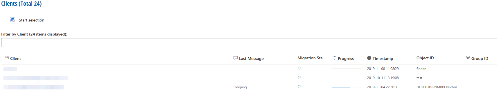

# Overview

The Clients menu in RealMigrator contains all clients which a part of the project.

This overview offers different functions:

* A summary of all registered clients - **Clients (Total xx)**
* A filter function - **Filter by Client** (name search)
* Seven different attributes

## Attributes

| Attribute        | Explanation                                                                                                                                                                                                                                                          |
| ---------------- | -------------------------------------------------------------------------------------------------------------------------------------------------------------------------------------------------------------------------------------------------------------------- |
| Client           | Client name based on a UPN                                                                                                                                                                                                                                           |
| Last Message     | 
Message about the last status of the client. For example: <strong>Finished migration</strong>: Migration is done <strong>Sleeping</strong>: Migration is paused <strong>running '[example]' module</strong>: Migration for this module is running.
   |
| Migration Status | 
Finished migration (check mark) = Migration is done without errors Finished migration with error (exclamation mark) = Finished migration but with an error Sleeping migration or running migration and more (progress icon) = migration is not finished
 |
| Progress         | A progress bar                                                                                                                                                                                                                                                       |
| Timestamp        | Date and time of **Last Message**                                                                                                                                                                                                                                    |
| Object ID        | Identification number of the current migration                                                                                                                                                                                                                       |
| Group ID         | Identification number of group where the client is registered                                                                                                                                                                                                        |

## Attributes order

As default, the list follows an alphabetic order (A to Z) refers to **Client**. With a click on the attribute **Client,** the order changed to a Z to A order.\
With clicks on other attributes, the list will deliver other orders.

## Assign to group

1. Click **Start selection** at the top of the menu
2. Choose one or more clients
3. Click **Assign to group** at the top of the menu
4. Choose a group
5. Click **Assign**

## Delete a client

1. Click **Start selection** at the top of the menu
2. Choose one or more clients
3. Click **Delete** in the upper-right corner of the menu
