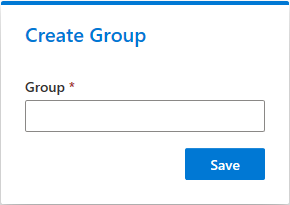
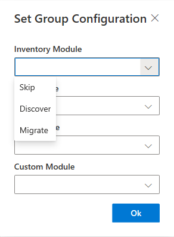
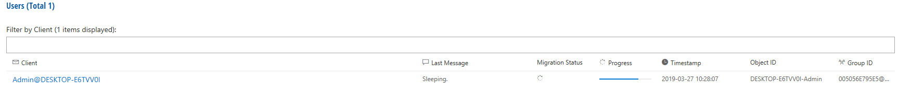

# Groups Configurations

## Add a new group

1. Click **+Add** at the top of the page
2. Assign a group name
3. Click **Save**

## Set Module Configuration

1. Click **Start selection** at the top of the page
2. Click on one or more groups to select them
3. Click **Set Module Configuration**
4. Use the drop-down menus to configure the modules (**Skip**, **Discover** or **Migrate** - explanation see table below)
5. Click **Ok**

| Command      | Description                                                                         | file module | PST module | inventory module |
| ------------ | ----------------------------------------------------------------------------------- | :---------: | :--------: | :--------------: |
| **skip**     | module is not executed                                                              |      +      |      +     |         +        |
| **discover** | module discovers items the client and sends a report, but does not migrate any data |      +      |      +     |         +        |
| **migrate**  | migrates data continuously                                                          |      +      |      +     |         -        |

## Multiple group deletion

1. Click **Start selection** at the top fo the page
2. Click on one or more groups to select them
3. Click **Delete** to delete the chosen groups

## Users Overview

This overview shows all registered clients in the group. These listed clients are equal to the listed clients in the input field **Assigned Objects**, but the user overview offers more information about a client.

The following table will explain about this information (attributes)

| Attribute        | Explanation                                                                                                                                                                                                                                                          |
| ---------------- | -------------------------------------------------------------------------------------------------------------------------------------------------------------------------------------------------------------------------------------------------------------------- |
| Client           | Client name based on a UPN                                                                                                                                                                                                                                           |
| Last Message     | 
Message about the last status of the client. For example: <strong>Finished migration</strong>: Migration is done <strong>Sleeping</strong>: Migration is paused <strong>running file module</strong>: Running file migration
                         |
| Migration Status | 
Finished migration (check mark) = Migration is done without errors Finished migration with error (exclamation mark) = Finished migration but with an error Sleeping migration or running migration and more (progress icon) = migration is not finished
 |
| Progress         | A progress bar                                                                                                                                                                                                                                                       |
| Timestamp        | Date and time of **Last Message**                                                                                                                                                                                                                                    |
| Object ID        | Identification number of the current migration                                                                                                                                                                                                                       |
| Group ID         | Identification number of group where the client is registered                                                                                                                                                                                                        |

A click on a client name will give additional information. For this topic see the documentation chapter \[Clients Menu]\(\{{< ref "clientmenu/client-information/\_index.md" >\}}).

## Assign to group

With **Assign to group,** it is possible to assign a client to a further group:

1. Click **Start selection** at the top of the menu
2. Choose one or more clients
3. Click **Assign to group** at the top of the menu
4. Choose a group
5. Click **Assign**

## Delete a group

To delete a group, click **Delete** in the upper-right corner of the screen.
