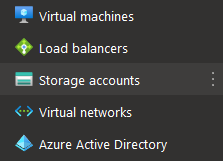
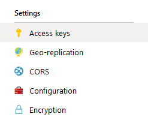

# Own Blob Storage

To switch a project to an own blob storage, do the following:

| Task                                                  | Image                                    |
| ----------------------------------------------------- | ---------------------------------------- |
| 1. Log in to [Azure Portal](https://portal.azure.com) |                                          |
| 2. Go to **Storage accounts**                         |  |
| 3. Choose one of your blob storages                   |                                          |
| 3. Then, navigate to **Access keys**                  |  |

Copy one of the two **Connection Strings**. A string looks like the following example:

> DefaultEndpointsProtocol=https;AccountName=myBlobAccountName;AccountKey=9aCzs76n0E7y5BpEi2gVsSv433BZa22leDOZXXeXIUa==;EndpointSuffix=core.windows.net

To create a blob storage container, obtain a container URL from Sample Container URL: https://storagesample.blob.core.windows.net/realmigratorContainer

Concatenate a connection string + **;BlobEndpoint=** + container URL to blob configuration string

#### Sample

> DefaultEndpointsProtocol=https;AccountName=myBlobAccountName;AccountKey=9aCzs76n0E7y5BpEi2GvsSv433BZa22leDOZXXeXXIUa==;EndpointSuffix=core.windows.net\
> ;BlobEndpoint=https://storagesample.blob.core.windows.net/realmigratorContainer

Navigate to myproject.realmigrator.com/config[^1] and enter a blob configuration string as External Storage. Then redeploy code and configuration files.

[^1]: Use an actual project name instead of 'myproject'
