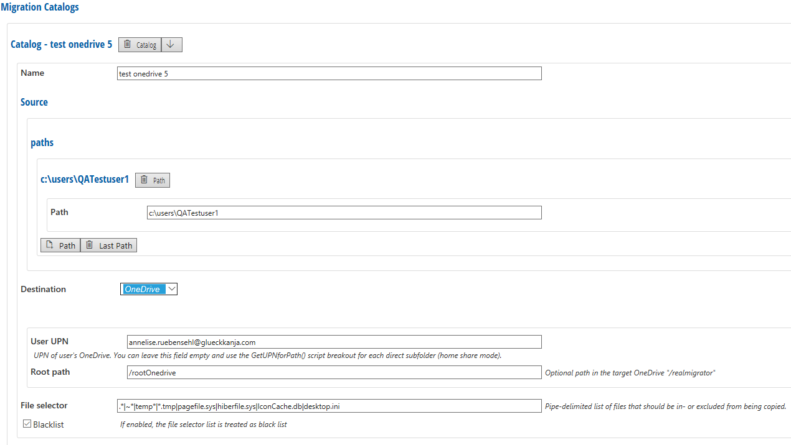
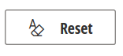

# Custom

Depending on the [Module Configuration](module-configuration.md) selection, the Custom Module contains different options and settings. When File or PST are selected, Custom Module will do the same as File or PST (For more information see [File documentation](file.md) and [PST documentation](pst.md).

The default configuration for Custom Module is **Server Migration**.

## Server Migration Settings

| Setting        | Explanation                                                                                                                                                                                                                                                                                                                                                                                                                                                                                                                                                                                                                                    |
| -------------- | ---------------------------------------------------------------------------------------------------------------------------------------------------------------------------------------------------------------------------------------------------------------------------------------------------------------------------------------------------------------------------------------------------------------------------------------------------------------------------------------------------------------------------------------------------------------------------------------------------------------------------------------------- |
| Service only   | If enabled, the server migration module will be executed only on clients running the RealMigrator service executable                                                                                                                                                                                                                                                                                                                                                                                                                                                                                                                           |
| Log level      | Available log levels are **Error**, **Info** and **Debug**                                                                                                                                                                                                                                                                                                                                                                                                                                                                                                                                                                                     |
| Reset code     | A client is always checking the own configurations after a defined period of time. This means that the client compares the selected client settings with the selected server settings. In addition the client connect to the server based on \[Module loop delay]\(\{{< ref "beginning/serverconfig/\_index.md#global-client-configuration" >\}}), a defined period of time. By this time value the client is starting a Module loop and the client is checking the Reset code. If there is a Reset code change the client will takes over the new configuration. If there is no change, the client will still use the existing configuration. |
| Path blacklist | Paths which are listed in a blacklist are excluded from all catalogs and will not be part of migrations (see \[Well-known folder] (\{{< ref "modules/wellknownfolder/\_index.md" >\}}) for folder (paths) list)                                                                                                                                                                                                                                                                                                                                                                                                                                |

### Discover Sources

* If **Local drives** is set to **enabled**, all local drives are discovered.
* If **Local shares** is set to **enabled**, all local shares are discovered.

**Folder scan depth** = Defines how many subfolders levels should be discovered.

### Path list

| Setting           | Explanation                                             |
| ----------------- | ------------------------------------------------------- |
| Path              | Migration path                                          |
| Folder scan depth | Defines how many subfolders levels should be discovered |

## Migration Catalogs

### Source

* Paths define a source for a migration
* You can add or delete paths

### Destination

* Defines a destination for a migration: **OneDrive**, **Sharepoint** or **Blob Store**. If you select on of these destinations you have to configure different settings:

OneDrive:

* **User UPN**: Enter a the UPN of the user. You can leave this field empty and use the "GetUPNforPath()" script breakout for each direct subfolder (home share mode)
* **Root path**: Optional path in the target OneDrive "/realmigrator"
* **File selector**: Pipe-delimited list of files that should be in- or excluded from being copied
* **Backlist**: If enabled, all paths which are listed in **File selector** will be excluded from all migration rules

Sharepoint:

* **Sharepoint URL**: Enter the Sharepoint URL for the destination of the migration
* **Root path**: Optional path in the target document library "/realmigrator"
* **File selector**: Pipe-delimited list of files that should be in- or excluded from being copied
* **Backlist**: If enabled, all paths which are listed in **File selector** will be excluded from all migration rules

Blob Store:

* **Root path**: Optional path in the target blob store, e. g. "/realmigrator"
* **Diff file size**: Files exceeding this size will be uploaded blockwise. Default: 4 MB
* **Diff block size**: Block size for blockwise upload. Default: 1 MB
* **File selector**: Pipe-delimited list of files that should be in- or excluded from being copied
* **Backlist**: If enabled, all paths which are listed in **File selector** will be excluded from all migration rules

### Catalog Order

Use the **up and down buttons** to change the order of paths:

### Create and Delete catalogs

At the bottom of the page there are buttons to create new catalogs or delete existing ones:

* To add further catalogs click the button **Catalog**
* To delete the last created catalog click the button **Last Catalog**
* To delete all of them, click the button **All**

## Script

To create and configure own **Migration Rules** use **Script**

## Reset Button

If you click the **Reset** button in the **Config** tab or in the **Script** tab, all your entries will be reset to the RealMigrator default values.

To accept the default values, you have to click **Save** at the top of the page.
