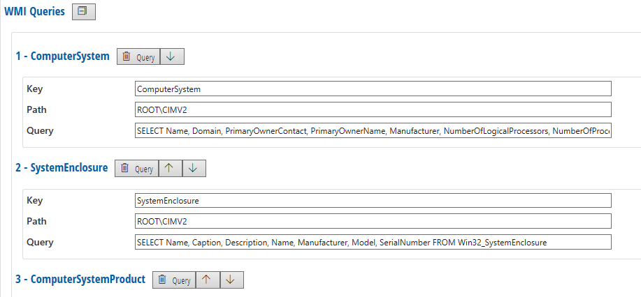
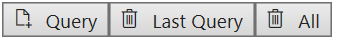
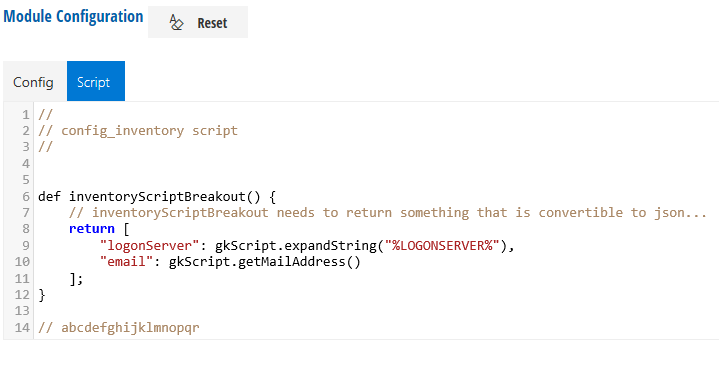

# Inventory

With Inventory, RealMigrator collects machine data through **Windows Management Instrumentation** (WMI). Depending on settings and configurations, RealMigrator collects data about disk drives, processors, drivers, monitors, printers, software settings and more. This data will migrate to Windows 10 to configure a computer with the previous settings from Windows 7.

## Inventory Settings

| Setting                 | Explanation                                                                                              |
| ----------------------- | -------------------------------------------------------------------------------------------------------- |
| Run WMI Queries         | RealMigrator will run the selected WMI Queries                                                           |
| Read Installer registry | RealMigrator will read the installer registry on a client computer                                       |
| Enum drives             | RealMigrator collects data about existing drives                                                         |
| Enum mail accounts      | RealMigrator collects data about existing mail accounts                                                  |
| Check network bandwidth | RealMigrator will check and record the network bandwidth of a client computer or a whole company network |
| Execute script breakout |                                                                                                          |
| Log level               | Available log levels are **Error**, **Info** and **Debug**.                                              |
| Power mode              | If this mode is activated, power down is prevented during migration.                                     |

## WMI Queries

Some **WMI Queries** are preset as standard. As it was mentioned before, RealMigrator has the ability to read system and computer settings.

| Setting | Explanation                              |
| ------- | ---------------------------------------- |
| Key     | Name of the query                        |
| Path    | Query will running from the entered path |
| Query   | Tasks of the query                       |

### Query Order

Use the **up and down buttons** to change the order of the queries

## Create and Delete queries

At the bottom of the page there are buttons to create new queries or delete existing ones

* To add further queries, click the button **Query**
* To delete the last created query, click the button **Last Query**
* To delete all of them, click the button **All**

## Script

RealMigrator offers a default script for Inventory. But it is possible to edit the existing script or to write a new script.

## Reset Button

If you click the **Reset** button in the **Config** tab or in the **Script** tab, all your entries will be reset to the RealMigrator default values.

To accept the default values, you have to click **Save** at the top of the page.
