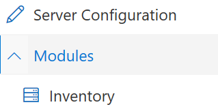
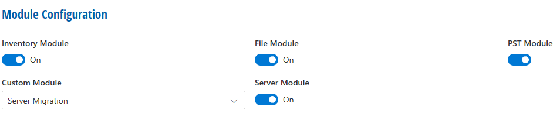
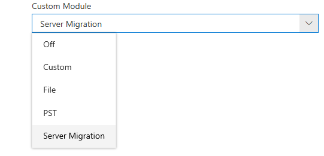

# Module Configuration

With Module Configuration, a Super Administrator has the possibility to determine which module will be **On** and which one will be **Off**. As default, **On** is preselected for all **Modules**.

To open Module Configuration, click **Modules**

The following overview will appear:

## Custom Module

This module can have different features or configurations, depending on the following module settings:

| Setting          | Explanation                                                                                                                     |
| ---------------- | ------------------------------------------------------------------------------------------------------------------------------- |
| Off              | Custom Module is deactivated                                                                                                    |
| Custom           | Custom Module is working with chaiScripts. A customer can use chaiScripts to customizes this module in a own way.               |
| File             | Custom Module has the role of a further File Module                                                                             |
| PST              | Custom Module has the role of a further PST Module                                                                              |
| Server Migration | It collects data from a file share server and migrates them to a defined storage (like OneDrive, SharePoint or a Blob Storage). |
