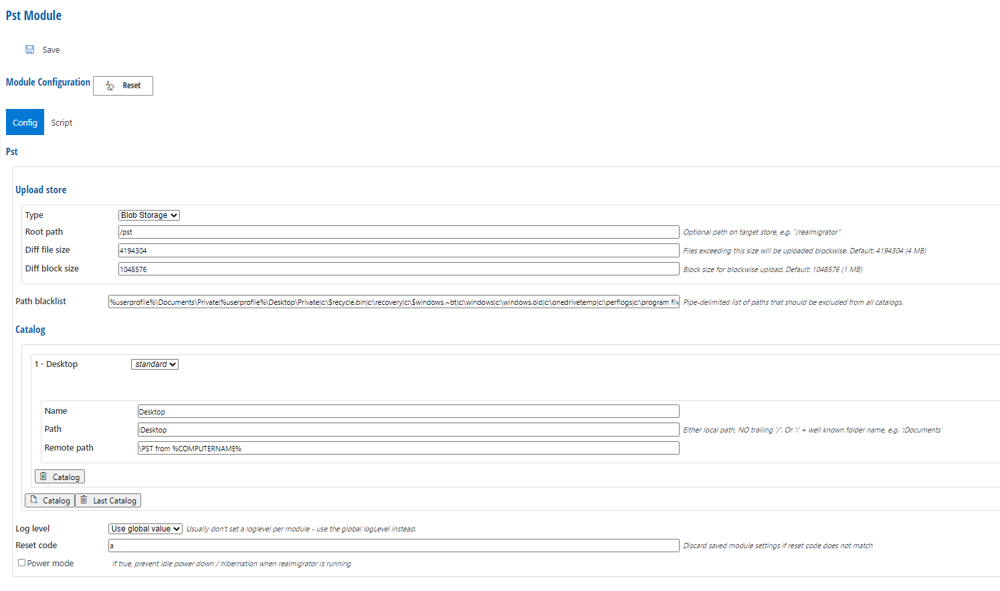
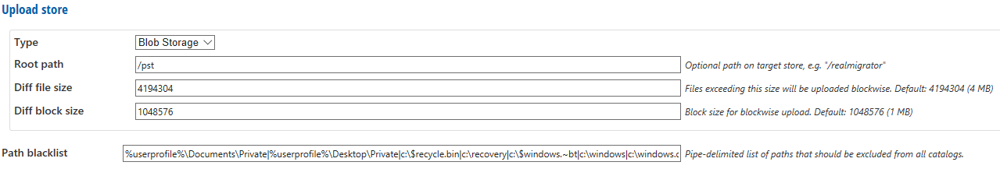
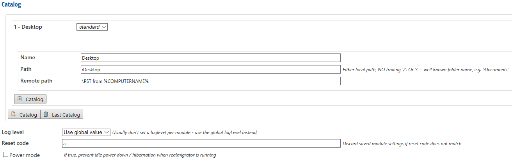
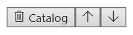
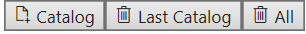
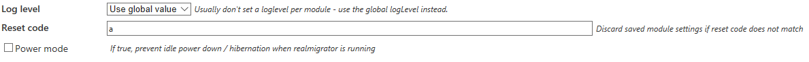
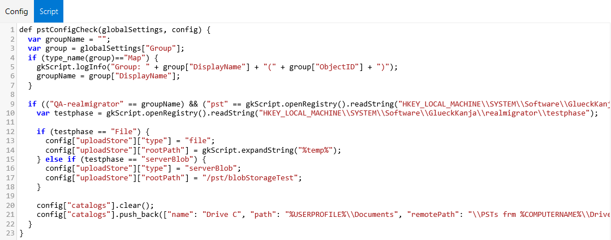

# PST

The PST Module contains options to configure the searches of PST files which have to migrate. RealMigrator looks for these PST files and copies them to a defined destination.

## Upload Store

Upload Stores always support basic PST file operations (upload file, create directory). They can support delete operations on PST files and directories to support proper synchronization.\
In addition, Upload Stores can support blockmode uploads, which enable differential uploads based on hash maps.

| Setting         | Explanation                                                                                                                                                                                                                                                                        |
| --------------- | ---------------------------------------------------------------------------------------------------------------------------------------------------------------------------------------------------------------------------------------------------------------------------------- |
| Type            | 
<strong>File</strong>: Writes to a file back-end, either local or on a file server <strong>OneDrive</strong>: Stores to the user's OneDrive via a RealMigrator server Graph API <strong>Blob Storage</strong>: Stores a blob storage via RealMigrator server Blob API
 |
| Root path       | Default root path                                                                                                                                                                                                                                                                  |
| Diff file size  | 
Default size are 4 MB. When a file exceeding this size it will be uploaded in blocks. (It is possible to define a own size)
                                                                                                                                              |
| Diff block size | When a file has to uploaded in blocks the default size is 1 MB                                                                                                                                                                                                                     |
| Path blacklist  | Paths which are listed in a blacklist are excluded from all catalogs and will not be part of migrations (see \[Well-known folder] (\{{< ref "modules/wellknownfolder/\_index.md" >\}}) for folder (paths) list)                                                                    |

## Catalog

A catalog defines which files RealMigrator has to migrate and where to find them

| Setting     | Explanation                                                                                                                                                            |
| ----------- | ---------------------------------------------------------------------------------------------------------------------------------------------------------------------- |
| Name        | Name of the catalog                                                                                                                                                    |
| Path        | Concrete path and place where RealMigrator will find the files (see \[Well-known folder] (\{{< ref "modules/wellknownfolder/\_index.md" >\}}) for folder (paths) list) |
| Remote path | Defined destination for **Path**                                                                                                                                       |

### Filter Function

The input field **Filter function** only appears when a catalog is set on _**custom**_

In comparison to the filter from the File Module, the **Filter function** is more extensive and more exact. The usual filter just searching for file formats. With the **Filter function,** you can search for file formats and email attachments, files with specific sizes and more.

Because the **Filter function** has to be implemented into a script (see **Script** below) it can be customized to the own needs and wants.

After a function is defined in a script, the name of this function has to enter the input field **Filter function**. When this is done, the Filter function is ready and RealMigrator will use it during a migration.

### Catalog Order

Use the **up and down buttons** to change the order of the queries:

### Create and Delete catalogs

At the bottom of the page, there are buttons to create new catalogs or delete existing ones:

* To add further catalogs click the button **Catalog**
* To delete the last created catalog click the button **Last Catalog**
* To delete all of them, click the button **All**

## Log level and Reset code

| Setting    | Explanation                                                                                                                                                                                                                                                                                                                                                                                                                                                                                                                                                                                                                                    |
| ---------- | ---------------------------------------------------------------------------------------------------------------------------------------------------------------------------------------------------------------------------------------------------------------------------------------------------------------------------------------------------------------------------------------------------------------------------------------------------------------------------------------------------------------------------------------------------------------------------------------------------------------------------------------------- |
| Log level  | Available log levels are **Error**, **Info** and **Debug**.                                                                                                                                                                                                                                                                                                                                                                                                                                                                                                                                                                                    |
| Reset Code | A client is always checking the own configurations after a defined period of time. This means that the client compares the selected client settings with the selected server settings. In addition the client connect to the server based on \[Module loop delay]\(\{{< ref "beginning/serverconfig/\_index.md#global-client-configuration" >\}}), a defined period of time. By this time value the client is starting a Module loop and the client is checking the Reset code. If there is a Reset code change the client will takes over the new configuration. If there is no change, the client will still use the existing configuration. |
| Power mode | If this mode is activated, power down is prevented during migration.                                                                                                                                                                                                                                                                                                                                                                                                                                                                                                                                                                           |

## Script

RealMigrator offers a default script for PST. But it is possible to edit the existing script or to write a new script.

## Reset Button

If you click the **Reset** button in the **Config** tab or in the **Script** tab, all your entries will be reset to the RealMigrator default values.

To accept the default values, you have to click **Save** at the top of the page.
