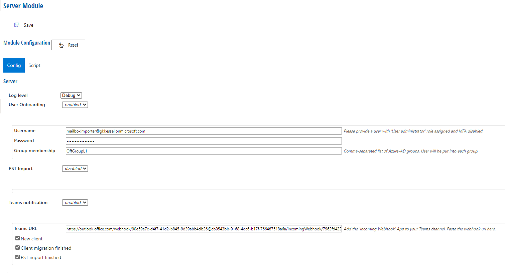
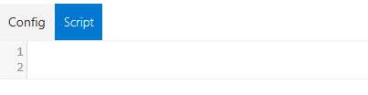

# Server

The Server Module contains configurations for a **PST Import** server. Furthermore, this module contains settings for **Teams notifications**.

## Server Configuration

**Log level** = available are **Error**, **Info** and **Debug**.

Set **User Onboarding** to _enabled_ to display the following settings:

| Settings         | Explanation                                                                      |
| ---------------- | -------------------------------------------------------------------------------- |
| Username         | Please provide a user with **User administrator** role assigned and MFA disabled |
| Password         | Password related to **Username**                                                 |
| Group membership | Comma-separated list fo Azure-AD groups. User will be put into each group        |

Set **PST Import** to _enabled_ to display the following settings:

| Settings                  | Explanation                                                                                                                                                        |
| ------------------------- | ------------------------------------------------------------------------------------------------------------------------------------------------------------------ |
| Username                  | Please provide a user with **Mailbox Import Export** role assigned and MFA disabled                                                                                |
| Password                  | Password of the mailbox importer                                                                                                                                   |
| Target Path               | Specifies the Mailbox folder that PST files are be imported to. Use **/** to import into the mailbox root, leave blank to generate the path from PST's source path |
| Archive                   | Enable this option to import the PSTs to the user's archive mailbox                                                                                                |
| Multi-Geo capabilities    | Enable this option if your Exchange Online tenant is configured for multi-geo support                                                                              |
| Remove completed requests | Enable this option if you want to remove completed import requests                                                                                                 |

## Teams notification

When Teams notification is enabled, RealMigrator will send notifications and messages to a defined Microsoft Team. Therefore, it is necessary to enter a **Teams URL**.

Select or deselect the following notification reasons:

* **New client**
* **Client migration finished**
* **PST import finished**

## Script

To create and configure own **Migration Rules,** use **Script**

## Reset Button

If you click the **Reset** button in the **Config** tab or in the **Script** tab, all your entries will be reset to the RealMigrator default values.

To accept the default values, you have to click **Save** at the top of the page.
