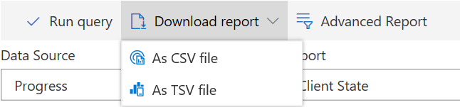

# Reporting

In the Reporting menu there are three different filters: **Data Source**, **Report** and **Group**. Additionally, all of these filters have different attributes. Available selections depending on the attributes of other filters.

> For example: When a user choose PST for **Data Source**, only PST state and PST details are available for **Report**. If an user choose Progress for **Data Source** then there are four different settings are available in **Report**: Client State, Module State Per Client, Group Assignments and Group Commands.

The following table gives a detail overview of all three filters:

| Data Source | Report                                                                                | Group                                                       |
| ----------- | ------------------------------------------------------------------------------------- | ----------------------------------------------------------- |
| Progress    | 
Client State Module State Per Client Group Assignments Group Commands
 | 
Unassigned Clients All Clients Existing groups
 |
| Inventory   | 
Client State Module State Per Client Group Assignments Group Commands
 | 
Unassigned Clients All Clients Existing groups
 |
| File        | 
File state File state anonymized
                                            | 
Unassigned Clients All Clients Existing groups
 |
| PST         | 
PST state PST details
                                                       | 
Unassigned Clients All Clients Existing groups
 |
| Datasource  | Report                                                                                | 
Unassigned Clients All Clients Existing groups
 |

Choose filters and click **Run Query** to create a report.

The following example shows reports with the filters attributes **Progress**, **Client State** and **All Clients**:

## Filter Rows

Click **Filter Rows** to open the filters (upper-right corner above the list)

The filters appear:

Enter a single letter, a pair of a letter or a word and the filter will show a result which is equal to the entered letters.

For example, **in**:

The filter shows **in progress** and **finished** because **in** is part of both words.

Click **Filter Rows** again to close the filters.

## Download report

The example above contains information about all clients and their status of migration. Additionally, information about the groups where the client is assigned. To download a report, click **Download report** at the top of the page. Choose **As CSV file** or **As TSV file**:

## Advanced Report

To configure the report list in any own way, click **Advanced Report** at the top of the page:

